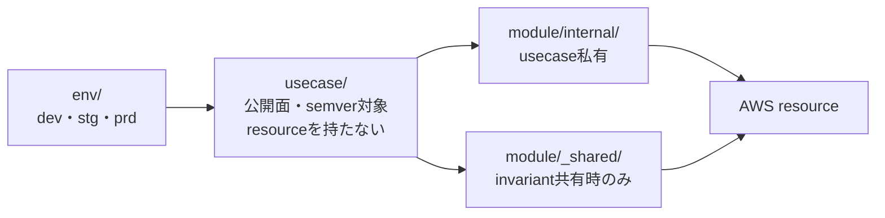

# terraform-aws-boilerplate 要件定義書 v0.2

> **この文書は v1.0 までの暫定である。** v1.0 到達時に削除する。内容は `modules/<use-case>/README.md` と ADR へ移る（ADR-0701 決定2）。
>
> **リポジトリに残るものからこの文書を参照しない** —— `modules/<use-case>/README.md`、ADR、`.tf`、コードコメント。参照したくなったなら、その内容は参照先の文書が所有すべきものである。Issue と Pull Request からの参照は許す。

## 1. 文書の位置づけ

本書は、`terraform-aws-boilerplate`（以下 tabp）の要件定義書 v0.1 に対する議論の結果を統合した改訂版である。対象はtabpが提供するAWS構成と、その接続契約である。`go-boilerplate`（以下 GBp）は参照となる利用者の一つであり、tabpの範囲を規定しない（第3節）。実装の詳細仕様やAccepted ADRの変更を、本書だけで成立させるものではない。

| 状態 | 意味 |
|---|---|
| **確定** | ユーザーが明示した方針、または確認済みのGBp現行契約 |
| **採用案** | 議論を経て採り入れた方針。個別の公開契約は実装時に確定 |
| **要決定** | 実装前または該当ユースケースの実装時に決める事項。時点は第12節に記載 |

### 1.1 目的

tabpは汎用的なAWS resource wrapper集ではない。業務系システムで使うAWS構成を、安全かつ再現可能に成立させる参照実装を提供する。利用者にresourceの細部を組み立てさせる代わりに、用途、責務境界、接続契約、セキュリティ、監視、検証方法を示す。

### 1.2 v1.0の意味

**確定:** 代表構成だけを先に出してv1.0とはしない。第7節のユースケースと接続シナリオ、第8節の原案候補を一通り実装・検証してからv1.0とする。要件と矛盾する構成は対象に含めない。

非公開画像の利用側実装（[GBp Issue #1648](https://github.com/Tomy-ch/go-boilerplate/issues/1648)）は、GBpがユースケースとして取り込むかを検討するためのものであり、その完了はtabpのv1.0条件に含めない。

### 1.3 v0.1からの主な変更

- 三層の責務原則（表現・処理・リソース）と、業務ロジック所有の禁止を追加した（第2節）。
- 公開境界を env → usecase → module の三層に確定し、usecaseを必須とした。usecaseはresourceを宣言しない合成層とした（第3節・第3.1節）。
- usecaseの範囲をGBpの機能の有無で決めないこととし、GBp Issue #1648の完了をv1.0条件から外した。
- EC2/Lightsail/Amplify/EKSを代替プラットフォームのusecaseとし、プラットフォーム×役割の対応表を新設した（第4節）。
- Realtimeの永続資源をTerraform所有に確定し、GBpに焼き込まない基盤制約を「tabp規約」として新設した（第5節）。
- ユースケースを41件に拡張した（第7節）。
- 会社固有の要件に左右される接続（オンプレ、取引先、定義外のクロスアカウント）、SQS FIFO、DRを対象外とした（第7.2節）。
- 観測を cloudwatch / otel / dual の三モードとし、otelモードの送り先をAWS外（自宅のobp）と想定した（第9.3節）。
- 本番から下位環境へのデータ同期（`data-refresh`）を追加した（第9.6節）。
- 検証戦略、アカウント構成、実装順序とbootstrapを新設した（第10節）。
- usecase Issueの必須項目と完了条件を追加した（第11.1節）。

## 2. 層責務原則とシステム責務

**確定:** FEは表現層、BEは処理層、インフラ（tabp）はリソース層に徹する。最も避けるべきは、**業務ロジックをインフラが所有すること**の一点である。

| 所有者 | 層 | 責務 |
|---|---|---|
| FE | 表現 | 操作と表示。BEから受け取るデータ、画像URL、処理状態を表現する。認可の正本や署名鍵を持たない |
| BE（GBp利用アプリ） | 処理 | HTTP API、業務認可、状態遷移、ジョブ、メッセージ処理、非公開画像の閲覧可否とURL発行、通知内容の決定。**責務の割当であり、実装の有無ではない** —— 非公開画像の署名付きURL発行は現行GBpに無い（第6.2節） |
| tabp | リソース | AWSリソース、IAM、ネットワーク、接続、監視、デプロイ先の機構、検証済みの利用構成 |
| 発火側 | — | 起動後の確認、更新、失敗検知、復旧トリガー。必要に応じて後続作業を連鎖起動する |

### 2.1 業務ロジックの判定基準

判定の問いは「業務要件が変わったとき、そのコードを変更する必要があるか」とする。

- **変更が必要なもの**は業務ロジックであり、BEが所有する。例: 閲覧可否、状態遷移、業務データの検証、通知内容の決定。
- **変更が不要なもの**は技術的ロジックであり、インフラにあってよい。例: ヘッダーの正規化、URLの書き換え、AWSサービス間の形式変換、プロトコル処理。

仕組みと決定が同じ箇所に現れる場合は、インフラが仕組みを持ち、BEが決定とデータを持つ。例: 非公開画像の拒否リスト照合はインフラ、何を失効させるかとリストの中身はBEが持つ。

論理リソース（ルーティング、event pattern、フィルタ等）は問題としない。

### 2.2 インフラ内コードのゲート

業務ロジックかどうかは機械的に判定できない。CIはコード実行を伴う箇所を検出して人間のレビューへ回し、判定は明確に意思決定できる人間が行う。

- **対象:** tabpのリポジトリがソースを持つコード。Lambda、Lambda@Edge、CloudFront Functions、Terraformの`local-exec`/`remote-exec` provisioner、`external` data source。
- **対象外:** ソースを他リポジトリが持ち、tabpは実行基盤の設定だけを持つもの。例: AmplifyのSSR関数はFEが所有する。ソースを持つ側がそのロジックの所有者として責任を負う。
- **対象外:** リポジトリ運用機構（`scripts/` のGo）。AWS上の実行経路に入らず、`terraform` の実行経路にも入らない（ADR-0702 決定3）。**ただし最後の項が求める「各言語でlintとtestを必須ゲートとする」は、Goについては既に満たされている**（`go-test`、`mod-tidy-check`、golangci-lintがrequired）。新しい言語を採用したときに、同じ水準を用意する。
- **ゲート:** policy testで対象を検出し、許可リストにないものはCIを失敗させる。許可リストはCODEOWNERSで人間のレビューを必須とする。
- **許可リストの記載事項:** ADRへの参照。ADRには、ネイティブ統合で解けない理由、入出力、失敗時の扱い、「業務要件の変更で修正が必要にならない理由」を必須で記載する。
- **承認後:** ソース、依存ライブラリ、ビルド手順をtabp内で管理する。採用した**各言語**でlintとtestをCIの必須ゲートとする。
- EC2/Lightsailの`user_data`は起動処理（エージェント導入、イメージ取得）に限定し、アプリのロジックを置かない。

### 2.3 処理層がリソースを作る箇所

Realtimeで`serve`がインスタンス別SQS Queue/SNS Subscriptionを実行時に作成・削除する。これはプロセスのライフサイクルに従属する実行時状態であり、業務ロジックの所在とは無関係なので許容する。範囲は第5.4節のprefix制限に従う。

## 3. 公開境界と構成

**確定:** 構成は env → usecase → module の三層とし、envは必ずusecaseを経由する。公開面とsemver保証の対象はusecaseのみで、moduleは内部実装とする。ディレクトリ名は後で決めるが、本書では暫定的に `env/`、`modules/<usecase>/`、`modules/<usecase>/internal/`、`modules/_shared/` と書く。

envはusecaseだけを呼ぶ。usecaseはmoduleの合成だけを行い、resourceを直接宣言しない。resourceはすべてmoduleが所有する。

**確定:** envのtokenは`dev` / `stg` / `prd`とする。これはディレクトリ名であると同時に、AWS資源の命名（`<project>-<env>-...`）に入る値でもある。envを増やす場合も同じ長さの短縮形を使う。

`sandbox`と`admin`は例外のtokenであり、**開発者が使うための環境ではない**。`sandbox`は検証の器（第10.2節）、`admin`は管理アカウント（第10.1節）で、どちらもアプリケーションを継続的に載せる場所ではない。ブランチ名（`develop` / `staging` / `release/*`）はenvのtokenとは別の軸であり、混同しない。

| 層 | 責務 | 規約 |
|---|---|---|
| env | 環境ごとの差異。最上段のapply単位 | 値と組み合わせのみを持つ。アカウント固有の識別子（Route53 Zone、ACM、KMS、既存VPC等）は入力で受ける |
| usecase | ユースケースごとの構成 | 公開契約を持つ。supported/unsupported、入出力、所有者、検証方法を記録する。resourceを宣言せず、moduleの合成と入出力だけを持つ |
| module | resourceの所有と不変条件の強制。関心事の単位で束ねる | 公開面をベストプラクティスで絞る。属性を素通しするだけの薄いラップは作らない |

- `module`ブロックの`source`が指してよい先を層ごとに固定し、外れたらCIで失敗させる。`env/`は`modules/<``usecase``>``/`のみ、usecaseは自分の`internal/`と`modules/``_shared/`のみ、`internal/`の module は同じusecaseの`internal/`配下と`modules/``_shared/`のみ、`modules/``_shared/`は`modules/``_shared/`のみを指す。他usecaseの`internal/`を指すことを禁じる。
- usecase間の接続識別子はARN、ID、Endpoint、DNS名、Subnet ID等とし、他usecaseの内部resource addressへ依存しない。受け渡しはremote stateまたはSSM Parameterで行う。
- 同一役割の複数ServiceやNodeGroupを表現できる。ただし任意の組合せを許す無制限な設定口は作らない。
- stateの分割粒度（ライフサイクル単位で分ける案）はusecase実装時に確定する。

**確定:** usecaseの範囲はGBpの機能の有無で決めない。接続契約はエンドポイント、プロトコル、認証、ネットワーク境界の水準で定義し、利用側の実装に依存させない。GBpは参照となる利用者の一つであり、tabpの範囲を規定するものではない。

### 3.1 usecaseは合成層である

**確定:** usecaseディレクトリに `resource` を1つも置かない。置けるのは `terraform`（`required_providers`、`required_version`。ADR-0205 決定7-8）、`module`、`variable`、`output`、`locals`、`data`、`moved`、`removed`、`import`、`check`、`ephemeral` とする。配線は独立したresourceではなく、受け側moduleの意味論的な入力として表す（ADR-0201 決定4-5）。

| 配線したいもの | 表し方 |
|---|---|
| Security Groupのルール | 守られる側のmoduleの入力（例: `ingress_from = { alb = <sg_id> }`） |
| usecase固有のIAM Policy | principalを持つmoduleの入力（例: `permissions = { sqs_consume = [<queue_arn>] }`） |
| Route53レコード | 公開面を持つmoduleの入力（例: `dns = { zone_id, name }`） |
| EventBridgeのRule/Target | Rule・Target・Target Role・DLQを1関心事として束ねたmodule |
| 出力用のSSM Parameter | 契約を書き出すmodule |
| resource-level policy（S3/SQS/SNS/KMS） | 親resourceを所有するmoduleが1文書だけ生成する。不変条件は無条件に出し、用途別の許可はgrantee種別をキーにした型付き入力で受ける |

- 検査は3本とする。(1) usecase直下にmanaged resourceが無いこと。(2) moduleの`source`が層ごとの許可された方向だけを指すこと。(3) attachment型のresource（bucket policy、queue policy、Security Groupのルール、role policy等）が親を指す引数に`module.`参照を持たないこと、すなわち親と同じmoduleに在ること。
- moduleの粒度は関心事（強制すべき不変条件）の単位とする。置き場の既定は`modules/<usecase>/internal/`とし、`_shared/`へ出すのはinvariantを共有するときだけとする（ADR-0205 決定11-12）。
- IAM Policyはセキュリティに直結するため、`"*"`のaction・resourceの禁止などの最小権限検査をpolicy testで別途担保する。
- 入力を持たず引数を公式推奨に固定した1-resourceのmoduleは、薄いラップに当たらない。ADR-0101 決定9 が警戒するのはProviderの引数と`variable`の1:1対応であって、resourceの数ではない。
- usecaseをまたぐgranteeをConditionで限定するときは、まずresource参照による依存順序の解決を試みる。受け側のpolicyが送り側のARNを要し、送り側が受け側のARNを要して循環する場合に限り、名前規約から導いたprefixベースのARN patternをConditionに用い、根拠を当該usecaseのADRへ記録する（ADR-0301 決定11）。送り側を先にapplyする2段の手順を規約にしない。

### 3.2 ADR-0102との関係

[ADR-0102](https://github.com/Tomy-ch/terraform-aws-boilerplate/blob/release/v0.1.0/docs/adr/0102-use-case-centric-scope.md)の「ユースケース公開、primitiveは内部」という骨格は維持される。改訂はenv層の追加と、moduleの位置づけ（不変条件を強制する内部部品）の明記に留まる。元文書のCapability公開＋Composition Preset案は採用しない。

## 4. Computeとプラットフォーム

**確定:** 標準ComputeはECSとする。EC2、Lightsail、Amplify、EKSは代替プラットフォームであり、用途を限定しきらずにサービスユースケースとして定義する。対応範囲は4.1の対応表に従い、何でも許可はしない。

- ECSでは、HTTPはECS Service、非同期WorkerはECS Service、単発バッチ・保守JobはECS RunTaskを使う。
- Lambdaで業務Worker、Cron、通常の業務APIを実装しない。Lambdaの採用は第2.2節のゲートに従う。

### 4.1 プラットフォーム×役割 対応表

**要決定（中身）:** 表の作成は確定。各セルの supported / unsupported を実装時に埋める。

| プラットフォーム | 想定用途 | serve | worker | outbox-relay | job | migrate-up |
|---|---|---|---|---|---|---|
| ECS | 標準 | ○ | ○ | ○ | ○ | ○ |
| EC2 | 小規模のBE・FE | 要決定 | 要決定 | 要決定 | 要決定 | 要決定 |
| Lightsail | PoC・小規模 | 要決定 | 要決定 | 要決定 | 要決定 | 要決定 |
| Amplify | FE・BFF | 対象外 | 対象外 | 対象外 | 対象外 | 対象外 |
| EKS | サービス全体 | k8s-bp | k8s-bp | k8s-bp | k8s-bp | k8s-bp |

AmplifyのBFFはFEが所有する表現層であり、GBpの役割は載せない。EKSのworkloadは`k8s-boilerplate`の責務とする。

### 4.2 Lightsail

LightsailはPoC・小規模向けとし、システムが大きくなる前のECS移行を推奨する。自己完結構成のため、private subnet、VPC Endpoint、Role分離等の横断要件を満たせない。

- 適用除外とする横断要件を列挙する（**要決定:** 中身）。
- ECSへの移行経路を成果物に含める（**要決定:** 中身）。

### 4.3 Kubernetes

tabpが扱うEKSの範囲はCluster、複数NodeGroup、IAM、Pod Identity/IRSA、Networking、AWS Add-ons、観測への接続まで。Deployment、Service、Ingress、HPA、NetworkPolicy等のworkloadは`k8s-boilerplate`の責務とする。

## 5. GBpとの実行契約

GBpは同じコンテナイメージをコマンドで切り替える。ECS専用のデプロイ処理はGBpにない。tabpは実行環境を用意し、発火側が順序と成否を管理できる接続口を渡す。

| GBpコマンド | 実行特性 | tabpの標準配置・必要な接続 |
|---|---|---|
| `serve` | HTTP APIと、必要時にSSEを提供して常駐 | ALB背後のECS Service。`/health`等のヘルスチェック、drainとSSE接続時間を整合 |
| `worker <name>` | SQSを継続ポーリング。ack、再試行、DLQ、終了時drainを処理。`:8081`にHTTPヘルスリスナ（`/healthz` liveness、`/readyz` readiness）を持つ | v1.0標準はECS Service。SQS、Task Role、Queue滞留に基づくAuto Scalingを接続。ヘルスチェックはこのリスナを使う |
| `outbox-relay --channel=...` | 常駐。HTTPヘルスリスナなし | チャネルごとのECS Service。配送先、外向き通信、ログ・メトリクスによる監視 |
| `job <name> [args...]` | 単発。成功0、失敗は非0 | ECS RunTask。Scheduler、EventBridge、手動発火等から起動 |
| `migrate-up` | 単発 | Service更新前のECS RunTask。成功確認は発火側 |
| `realtime-init` | Table/Topicを作る冪等な単発処理 | **AWSでは実行しない**（5.3） |

各Roleには、コマンド、CPU・メモリ、Task Role、Execution Role、subnet、Security Group、環境変数、Secrets参照、ログを独立して設定できる契約を設ける。`serve`、`worker`、`outbox-relay`でヘルスチェック方式を同一視しない。

### 5.1 Worker

WorkerはSIGTERMを受けてdrainし、通常の停止では成功終了できる。業務Handlerは利用側BEが登録する —— GBpはclone直後にsample worker（`withdrawal-archive`）を持つが、sampleを除去すると登録済みHandlerが無くなり、worker起動は未知のworker名として即終了する。v1.0の標準はServiceとし、最小タスク数1で接続を確認する。

DLQへの退避経路は2つある。アプリ側のFailureHandlerが`CONSUMER_QUEUE_DLQ_URL`へ送る経路と、brokerのRedrivePolicyが`maxReceiveCount`超過で送る経路である。`queue-worker`がどちらを標準とするかは実装時に決め、公開契約へ書く。0タスクまでの縮退は、起動遅延、復帰、処理中の縮退を実AWSで検証した後のオプションとする。SQSをPipesで消費して単発Taskを起動する構成は、GBpの既存Workerのack・再試行・DLQ経路と別物なので標準に含めない。

Queue滞留に基づくAuto Scalingは、「滞留数÷実行中タスク数」のmetric mathで構成する。

### 5.2 ジョブの重複と失敗

- **確定:** GBp既存の保守Job（`outbox-gc`、`idempotency-gc`、`orphan-cleanup`）は冪等かつ並行安全（GBp ADR-0109、`orphan-cleanup`は自身のREADME）。汎用の`job_id`排他ストアは追加しない。sample由来のJobはこの保証の外である。
- 新規JobはBE側で、再実行と並行実行に耐えることを個別に示す。耐えないJobだけ、発火側の排他またはJob固有のロックを設計する。
- EventBridge Schedulerの再試行・DLQはtarget起動失敗だけを扱う。Task起動後のコンテナ失敗は、ECS停止イベント、終了コード、ログで別に検知する。
- GBpに汎用ジョブ履歴テーブル、進捗率、取消APIを要求しない。終了コードのエラー分類機構も採用しない。

### 5.3 Realtime

GBpのRealtimeは、業務Transaction→outbox→EventLog→SNS→`serve`インスタンス別SQS Queue→SSEの経路を使う。

- **確定:** AWS上の永続Table/TopicはTerraformが所有する。`realtime-init`はローカル（Docker Compose）専用とし、AWSでは実行しない。
- 所有する資源はDynamoDB 3 table（`realtime_event_log_<suffix>` / `realtime_stream_ticket_<suffix>` / `realtime_instance_lease_<suffix>`。suffixは`REALTIME_TABLE_SUFFIX`）とSNS Topic 1つ。key schemaとTTL属性はGBpの`TableSpec`に合わせ、一致を検証項目とする。
- `serve`のTask RoleにTable/Topicの作成権限を付与しない。
- tabpは静的Queueを全インスタンス分は作らない。用途に絞ったIAM権限、永続Table/Topicとの接続、DLQ、観測を用意する。孤立したインスタンス資源の回収Jobを発火する。

### 5.4 動的Queueの権限

**確定:** インスタンス別Queueの範囲はprefixで制限する。タグは監査・リソース把握用に限定する。

- Queue名は`<REALTIME_QUEUE_PREFIX>-<instance id>`である。instance idはGBpが起動ごとに採番するUUID（36文字）でtabpからは制御できない。**tabpが管理するのはprefixであり、43文字以内に収める**（SQSの名前上限80文字に対するGBp側の制約）。
- `serve`のTask Roleに与えるのは、prefixで絞ったQueueに対する CreateQueue、**GetQueueAttributes**、SetQueueAttributes、ReceiveMessage、DeleteMessage、DeleteQueue と、対象Topicに対する Subscribe、**SetSubscriptionAttributes**、Unsubscribe、**Publish**（失効通知）である。GetQueueAttributesとSetSubscriptionAttributesが欠けると`serve`は起動に失敗する。
- SNSのSubscribeは`sns:Protocol = sqs`、`sns:Endpoint`をprefix付きQueue ARNに限定する。UnsubscribeとSetSubscriptionAttributesのIAM resourceはsubscription ARNであり、Topic ARNだけでは足りない可能性がある（実装前にAWSの文書で確認する）。
- 回収Jobが呼ぶのは`sns:ListSubscriptionsByTopic`→`sns:Unsubscribe`→`sqs:GetQueueUrl`→`sqs:DeleteQueue`と、lease tableへのDynamoDB操作である。**`ListQueues`は呼ばない。**
- 回収はinstance idのsuffixで照合しprefixを問わない。`REALTIME_QUEUE_PREFIX`を変えると、旧prefixの残骸に対して`GetQueueUrl`がAccessDeniedとなり回収Jobが毎回失敗する。prefixを変える運用をするなら、IAMの範囲をその想定に合わせる。
- GBpはQueueにタグを付けない（`CreateQueue`は`QueueName`のみ）。`sqs:TagQueue`は不要である。

### 5.5 tabp規約（GBpをtabpに載せる前提条件）

**確定:** 以下はデプロイ基盤の制約であり、GBpの非ベンダーロック方針と衝突するためGBpには焼き込まない。tabpの規約として定義する。

Workerの業務Handlerがat-least-once前提で冪等であること、SSEのクライアントが`Last-Event-ID`で再接続することは、**GBpが既に自身の契約として持っている**。tabpの規約として重複して定義せず、GBpの契約を前提とする。

- マイグレーションは後方互換（expand/contract）であること。tabpは内容を検査しない。違反するとrollbackが成立しない。
- Fargateの`stopTimeout`（最大120秒）を、GBpが持つ時間と整合させること。GBp側の既定は`APP_SHUTDOWN_TIMEOUT` 65秒、`WORKER_DRAIN_TIMEOUT` 30秒、`CONSUMER_QUEUE_VISIBILITY_TIMEOUT` 30秒で、`serve`のSSE drainは固定10秒である。**`stopTimeout`が`APP_SHUTDOWN_TIMEOUT`より短いと停止が切り詰められる**ため、65秒以上にするか`APP_SHUTDOWN_TIMEOUT`を実行時に縮める。drainが間に合わないメッセージは再配送される。
- SSEの基盤側要件を満たすこと。ALBのidle timeoutをheartbeat間隔より大きくし、stream pathのresponse bufferingを無効にし、**stream pathのアクセスログからquery stringを除外または秘匿する**（ticketがquery parameterで渡るため）。
- `public-api-gateway`経由のSSEはunsupportedとし、SSEは`public-api-alb`に寄せる。REST APIの response streaming（`STREAM`）を使えば SSE は技術的には成立するが、regional/private エンドポイントの idle timeout が5分、最長15分で切れ、endpoint caching と content encoding が使えず、追加課金が発生するため。

## 6. 画像・ファイル配信

業務画像はFEビルド成果物と独立したS3に保存し、公開・非公開で配信経路を分ける。

### 6.1 公開画像

業務画像用のS3 Bucketは非公開とし、CloudFront OACにだけ読み取りを許可する。FEは公開画像専用のCloudFront独自サブドメインから表示する。静的FEを廃棄しても業務画像は消さない。

### 6.2 非公開画像・ファイル

BEが利用者と対象画像の閲覧権限を判断し、期限付きのCloudFront署名付きURLと失効時刻をFEへ返す。

CSVエクスポート等の非公開ファイルも、画像と同じ機構で配信する。

- 公開画像とは別のS3 Bucket、CloudFront Distribution、独自サブドメインを使う。
- CloudFrontはTrusted Key Groupで署名を検証し、OAC経由で非公開Bucketを読む。
- FE向けURLにS3のホスト名とBucket名を含めない。オブジェクトキーに業務上の秘密を含めない。
- 署名用秘密鍵はFE、Terraform state、コンテナイメージに入れない。BEが実行時に取得する。公開鍵をKey Groupへ登録し、ローテーション中は新旧2つの鍵を併存させる。
- 署名パラメータがキャッシュキーに入らないことを実AWSで確認する。
- URLの失効は画像の削除ではない。期限前に取得済みのコピーは消せない。保持・削除期間は別の業務要件とする。
- S3署名付きGET URLのホスト名を独自サブドメインへ置き換える方法は標準経路としない。

**即時失効:** 署名付きURLは個別に期限前失効できない（Key Groupからの鍵削除による全体失効のみ）。即時失効が必要なら、短寿命URLで許容遅延を定義するか、CloudFront Functions＋KeyValueStoreの拒否リストを使う。後者の場合、照合処理はインフラ、失効対象の決定とリストの中身はBEが持つ（第2.1節）。CloudFront Functionsは第2.2節のゲート対象となる。

利用側の閲覧API、署名処理、URL寿命、即時失効の要否は利用側の責務とする。GBpでは[Issue #1648](https://github.com/Tomy-ch/go-boilerplate/issues/1648)で、ユースケースとして取り込むかを検討する。tabpの完了条件ではない。

### 6.3 アップロード

アップロードは`media-ingest`として閲覧方式と別に扱う。アップロード許可（署名付きPUT/POSTの発行）と、受け入れたファイルの業務上の扱いはBEの責務とする。tabpは受入用のS3、GuardDuty Malware Protection for S3、スキャン結果を観測する経路を持つ。スキャン結果タグが脅威なしでないオブジェクトの読み取りをBucket Policyで拒否し、ファイルの移動にインフラ内コードを使わない。

## 7. v1.0採用ユースケースと接続シナリオ

v1.0は41のユースケースと9の接続シナリオを対象とする（採用案）。各行は、解決する問題、実行形態、ネットワーク境界、公開契約、supported/unsupported、検証方法を実装前に定義する。複数行を1つの巨大な選択式usecaseへ統合しない。

| 分野 | ユースケース | 成立させる経路・役割 |
|---|---|---|
| FE | `static-web` | Route53/ACM/WAF→CloudFront→FE成果物用S3。成果物用BucketとDistribution IDを出力し、メンテナンス時の固定応答を入力で持つ |
| HTTP | `public-api-alb` | 公開ALB（WAF・rate-based ruleを付与可能）→ECS Service(`serve`)。OIDC認証action、送信元IP制限、メンテナンス時の固定応答を入力で持つ |
| HTTP | `public-api-gateway` | API Gateway REST API（WAFとusage plan/API keyはREST APIのみ）→VPC link V2→内部ALB→ECS Service(`serve`)。SSEはunsupported |
| HTTP | `private-api` | 内部到達に限定したALB→ECS Service(`serve`) |
| HTTP | `service-to-service` | 複数のGBpサービス間の内部通信（east-west）。内部ALBかECS Service Connect/Cloud Mapかは実装時に決定 |
| Identity | `identity-integration` | Cognitoまたは外部OIDC→FEの認証フロー→BEのBearer/JWKS検証。業務認可はBE。利用者種別（顧客・職員）ごとにUser PoolまたはApp Clientを分ける |
| Data | `private-rds` | RDS、私設接続、Secrets、監視、保護設定 |
| Data | `private-aurora` | Aurora、私設接続、Secrets、監視、保護設定 |
| Data | `cache` | ElastiCache（Valkey）への私設接続、認証、暗号化、監視 |
| Data | `search` | OpenSearchへの私設接続、アクセス制御、暗号化、監視 |
| Data | `business-analytics` | 業務データの分析基盤。RDSのS3エクスポート、Aurora zero-ETL→Redshift、QuickSight。ログ分析の`analytics`とは所有者・データが別 |
| Config | `runtime-config` | AppConfigによる実行時の設定・機能フラグの配布。フラグの意味と判断はBE |
| Async | `queue-worker` | SQS（標準キュー）→ECS Service(`worker`)。業務Handlerは利用側BEが登録 |
| Job | `on-demand-job` | 手動・リリース発火→ECS RunTask(`job`/`migrate-up`) |
| Job | `scheduled-job` | EventBridge Scheduler→ECS RunTask(`job`) |
| Event | `event-job` | EventBridge Rule→ECS RunTask。イベントからJob引数への契約が必要 |
| Event | `event-queue-worker` | EventBridge Rule→SQS→`queue-worker` |
| Delivery | `outbox-delivery` | ECS Service(`outbox-relay`)→HTTP等の配送先 |
| Delivery | `realtime-delivery` | outbox→DynamoDB EventLog→SNS→インスタンス別SQS→SSE |
| Delivery | `email-delivery` | BEが内容・宛先を決め、SESが配送。ドメインidentityのDKIM/SPF/DMARC、bounce・complaintのフィードバック経路（SNS→SQS→`queue-worker`）、送信quotaとbounce率のアラームを含む。抑止リストの内容と判断はBE |
| Delivery | `email-inbound` | SES受信→S3保存→EventBridge→SQS→`queue-worker`。受信内容の解釈はBE |
| Delivery | `sms-push-delivery` | BEが内容・宛先を決め、AWS End User Messaging（SMS）またはSNSモバイルプッシュが配送。配送結果を観測 |
| Media | `public-media` | 業務画像用S3→CloudFront OAC→公開画像サブドメイン |
| Media | `private-media` | 非公開の画像・ファイル（エクスポート等を含む）。署名付きURL→専用CloudFront/OAC→非公開S3 |
| Media | `media-ingest` | 署名付きアップロード→受入S3→GuardDuty Malware Protection for S3→スキャン結果タグで読み取りを制御（第6.3節） |
| Network | `private-aws-access` | VPC Endpoint等によるAWSサービスへの私設到達 |
| Network | `controlled-external-egress` | private subnetから明示した外部HTTPS宛先へ到達（第9.2節）。既定は無効で、有効にした環境だけがNATを持つ。制御手段の既定はNetwork Firewall。送信元IPの固定としてNAT GatewayのEIPを出力する |
| Security | `organization-baseline` | AWS Organizations、SCP、IAM Identity Center（人間のSSOログイン）。第10.1節のアカウント構成を構築する |
| Security | `account-baseline` | CloudTrail、GuardDuty、AWS Config、IAM Access Analyzer、アカウント単位のS3 Public Access Block、EBS既定暗号化 |
| Security | `audit-evidence` | 監査証跡（CloudTrail等）の改ざん防止保管。S3 Object Lock、長期保持、アクセス記録 |
| Access | `operator-access` | SSM Session Managerのポートフォワーディング、ECS Exec。インバウンドを開けずに人間がprivate資源へ到達 |
| Data | `data-refresh` | 本番（prd）→stgへの一方向のデータ同期。DBはBE提供のマスキングJobを必須とし、公開画像はコピー、非公開画像は同期しない（第9.6節）。既定は無効 |
| Compute | `ec2-service` | 小規模のBE・FE向けの代替プラットフォーム。Launch Template、Auto Scaling Group、IAM、Logging（第4節） |
| Compute | `eks` | サービス全体向けの代替プラットフォーム。Cluster、複数NodeGroup、Pod Identity/IRSA、Add-ons。workloadはk8s-boilerplate（第4.3節） |
| Compute | `amplify-app` | FE・BFF向けの代替プラットフォーム。App、Branch、Build設定、IAM。SSR関数はFE所有 |
| Compute | `lightsail-service` | PoC・小規模向けの自己完結構成。ECS移行経路を伴う（第4.2節） |
| Observability | `analytics` | AWSネイティブログの集計。Athena WorkGroup、Glueスキーマ、結果用S3。Log Groupの購読とS3ログの受け口（第9.3節） |
| Observability | `ops-notification` | 基盤系アラームの届け先。SNS Topicとsubscription、メトリクス途絶の検知、通知経路自体の死活。各usecaseはTopic ARNを入力で受ける。常駐層（第9.3節） |
| Governance | `finops` | AWS Budgets、Cost Anomaly Detection、通知先との接続。常駐層 |
| Governance | `deployment-identity` | CI/CD用OIDC、IAM Role/Policy、Trust Policy。アカウントごとのデプロイRole。長期アクセスキーを使わない |
| Governance | `state-backend` | Terraformのstate backend。Bucketの版管理・暗号化・Public Access Block、ロック、CI Role以外の書き込み拒否、アクセス記録。フェーズ0でCLI作成→importで突合する（ADR-0602 決定1-2・4-8）。常駐層 |

各ユースケースの出力契約には、ログの所在（Log Group ARN、S3にしか出せないログ種別のBucket）を含める（第9.3節）。

`ops-notification`を除く各ユースケースの入力契約には、基盤系アラームの通知先（`ops-notification`が出力するSNS Topic ARN）を含める（第9.3節）。フェーズ1では`ops-notification`を先に実装する。

### 7.1 接続シナリオ

| シナリオ | 成立させる処理 |
|---|---|
| `s3-event-job` | S3→EventBridge→`event-job`。単発処理の入力変換と結果観測 |
| `s3-event-queue-worker` | S3→EventBridge→SQS→`queue-worker`。滞留・再試行・DLQ |
| `webhook-processing` | 外部HTTP→BEの`serve`→必要ならSQS→`queue-worker`。認証・業務判断はBE |
| `release-flow` | 発火側→`migrate-up`成功確認→Service更新→状態確認→必要時の復旧トリガー |
| `fe-release-flow` | 発火側→FE成果物のS3配置→CloudFront invalidation→配信確認。`index.html`とhash付きassetでキャッシュ方針を分ける |
| `failure-recovery` | Scheduler起動失敗、Task失敗、SQS DLQ、outbox dead行の検知と発火側による再処理。dead行の再処理はGBpの`outbox-relay replay`を使う（第9.3節） |
| `backup-restore` | DB、業務画像、DynamoDB、OpenSearch、Secrets、AppConfigの版を対象とする保持要件に従ったバックアップ・版管理・復元確認。Cognito User Poolはネイティブな復元手段がなくunsupported |
| `staff-console` | 職員向け管理画面。`identity-integration`のOIDC→公開ALBの認証action→送信元IP制限→`serve`配下で配信。業務認可はBE |
| `domain-event-fanout` | `outbox-delivery`→EventBridge custom bus→複数の`event-queue-worker`。1:Nの配信とproducerの発行権限 |

- `release-flow`の発火側パイプライン（例: GitHub Actionsのworkflow）は接続例であり、tabpの保証範囲外とする。
- `event-job`の入力契約（イベントからJob入力への写像、サイズ、検証、再実行）は実装前に決める（第12節）。EventBridgeからTaskを起動できることだけで、イベント処理の完成とは扱わない。

### 7.2 原案からの統合・除外

- `async-worker`と`worker`は`queue-worker`へ統合する。
- `batch`は処理内容の総称とし、`on-demand-job`、`scheduled-job`、`event-job`へ分ける。
- `api`と`web-api`は公開経路・ネットワーク境界ごとに分ける。
- `serverless-api`は業務APIをLambdaに置くため採用しない。
- `lambda-kicker`は一般提供しない。直接統合できない具体的な連携が現れた場合だけ`aws-bridge-lambda`として第2.2節のゲートを通す。
- `s3-event-kicker`と`webhook-kicker`の標準経路からLambdaを外す。
- v0.2の議論で検討した`log-archive`は採用しない（第9.3節）。
- SQS FIFOによる順序保証の変種は採用しない。
- DR（クロスリージョンのバックアップ複製、マルチリージョン構成）はv1.0の対象外とする。`backup-restore`は同一リージョン内の保持・復元を対象とする。
- 業務フローを持つStep Functions、API GatewayのVTLによる業務変換は、業務ロジックをインフラが所有する形になるため採用しない（第2節）。

- 既存システム・オンプレとの接続（Site-to-Site VPN、Direct Connect、Transit Gateway、ハイブリッドDNS）と、取引先とのファイル授受（Transfer Family）は、会社固有の要件に左右されるため対象外とする。
- 第10.1節で定義したアカウント構成の外にあるクロスアカウント連携は対象外とする。

## 8. 原案候補の扱い

**確定:** v1.0を切る前に、元文書のCapability・Composite候補も一通り成立させる。以下はカバレッジ台帳であり、module単位を決める表ではない。各候補は用途と所有権に応じて、第7節のusecase内部、独立したusecase、または接続例に配置する。採否を変更する場合は、v1.0範囲の変更として記録する。

**確定:** usecase必須（第3節）の帰結として、envから呼ばれる候補はすべてusecaseとする。`ec2-service`、`eks`、`amplify-app`、`lightsail-service`、`analytics`、`finops`、`deployment-identity`は第7節のusecaseに含める。`ecs`、`cdn`、Capability群（`vpc`、`alb`等）はusecase内部のmoduleとする。**複数のusecaseが使うmoduleは、独立したIssueとして起票し、最初の消費者のusecase Issueをblockする。**1つのusecaseしか使わないmoduleのIssueは、そのusecase側に紐づける。第3.1節のとおり、置き場の既定は`modules/<usecase>/internal/`であり、`_shared/`へ出すのはinvariantを共有するときだけである。`bastion`は`operator-access`に統合する。

| 元の分類 | カバレッジ対象 |
|---|---|
| Network / Edge | `vpc`, `vpc-endpoint`, `route53`, `acm`, `alb`, `waf`, `apigateway` |
| Data | `s3`, `aurora`, `rds`, `dynamodb` |
| Messaging / Event | `sqs`, `sns`, `eventbridge` |
| Identity / Communication | `cognito`, `ses` |
| Container / Artifact | `ecr` |
| Shared security / configuration | `kms`, `secrets`。独立moduleの要否は判断するが、暗号化とSecrets管理のカバレッジは外さない |
| Composite | `bastion`, `ecs`, `cdn`, `ec2-service`, `eks`, `analytics`, `amplify-app`, `lightsail-service`, `finops`, `deployment-identity` |

| 候補 | 必要範囲 |
|---|---|
| `bastion` | SSM Session Managerベースで再定義し、EIPとSSHのインバウンドを持たない。operator-accessに統合する |
| `ecs` | Cluster、複数のService/Task Definition、Role分離、Logging、Deployment設定。ALBやDB等との接続は明示 |
| `cdn` | CloudFront、OAC、S3、Bucket Policy。FE成果物と業務画像のライフサイクルを区別 |
| `ec2-service` | Launch Template、Auto Scaling Group、IAM、Security Group、Logging。小規模のBE・FE向けの代替プラットフォーム（第4節） |
| `eks` | Cluster、複数NodeGroup、IAM、Pod Identity/IRSA、Networking、Add-ons。workloadは対象外 |
| `analytics` | AWSネイティブログの集計に限定した横断の消費者（第9.3節）。Athena WorkGroup、Glueのスキーマ、Query Result用S3。保存クエリ等の分析ロジックは置かない |
| `amplify-app` | App、Branch、Build設定、IAM。FE・BFF向け。SSR関数はFE所有 |
| `lightsail-service` | Instance、Static IP、Firewallの自己完結構成。PoC・小規模向け（第4.2節） |
| `finops` | AWS Budgets、Cost Anomaly Detection、通知先との接続。常駐層に属し、アプリ本体のライフサイクルから独立 |
| `deployment-identity` | CI/CD用OIDC、IAM Role/Policy、Trust Policy。長期AWSアクセスキーを標準経路にしない |

`cdn`がFE成果物を保持する場合、S3とCloudFrontを一体のライフサイクルにできる。業務画像は別データとしてS3を独立させる。

共有KMS、AWS Backup、Glue Catalogは独立したusecaseにせず、関係するusecase（`account-baseline`、`backup-restore`、`analytics`/`business-analytics`）の内部で扱う。

## 9. 横断要件

### 9.1 セキュリティ・設定値

- Public exposure最小、IAM最小権限、暗号化、TLS、S3 Public Access Block、private subnet優先、Role分離、Security Groupの過剰許可防止を初期設計に含める。
- Secretsを平文のTerraform variableや画像URLに載せない。Task Roleと実行時Secrets参照を使う。CloudFront署名用秘密鍵をTerraform stateへ入れない。
- 設定値は[ADR-0207](https://github.com/Tomy-ch/terraform-aws-boilerplate/blob/release/v0.1.0/docs/adr/0207-default-value-policy.md)に従い、AWS公式推奨をProvider/AWSの暗黙defaultより優先する。保証したいsecurity/reliability設定は明示する。
- 保持期間、可用性、容量、スケーリング、削除方針等の利用者固有の要件は焼き込まない。安全性の不変条件を維持しながら、入力を必要最小限に絞る。
- **暗号化の例外:** ALBのアクセスログとS3サーバーアクセスログの出力先BucketはSSE-KMSに非対応のため、SSE-S3とする。
- **検査の分担:** AWS一般のベストプラクティスとして成立するmisconfigurationはTrivyが担う（`make trivy-config`、required済み）。Policy Testは、ADR-0402 決定1-3 により**本リポジトリのADRを読まなければ書けないinvariantに限る**。Trivyが既定で持つ検査をPolicyへ重複して書かない。Trivyが本リポジトリのinvariantより緩い場合は、Trivyを無効化せずPolicyを追加して厳格化する（同 決定4）。

### 9.2 Egress

**確定:** 既定は外部egressを持たない。NATを置かず、AWSサービスへはVPC Endpointで到達する。外部HTTPSが必要な環境だけが`controlled-external-egress`を有効にし、その場合も宛先を明示したものに限定する。Security Groupのegressを既定の全許可のまま残さない。

| 宛先 | 経路 | 制御手段 |
|---|---|---|
| AWSサービス、別アカウントのprivate endpoint | VPC Endpoint、PrivateLink | Security Group、ルートテーブル、endpoint policy |
| インターネット上の宛先 | `controlled-external-egress`を有効にした環境のみ NAT→インターネット | Network Firewallのドメイン許可リスト＋Security Groupの外向きを443に限定。DNS Firewall単独は縮退構成 |

外部egressを持たないことを安全側の既定とし、外へ出ることの方を明示的な有効化で受ける（ADR-0301 決定2）。有効化した環境の制御手段はNetwork Firewallを既定とする。DNS Firewall単独はIP直指定で迂回され、送信主体は自前のCollectorだけでなく業務Handlerを積んだ`worker`、配送先を持つ`outbox-relay`、外部入力を受ける`serve`を含むため、費用優先の縮退構成として扱う。採用するならその理由を当該ユースケースのADRへ残し（ADR-0207 決定4）、、事後検知（Resolver query loggingとVPC Flow LogsのREJECT）を伴う。Network Firewallの費用はエンドポイント1個あたり0.395 USD/時、処理が1 GBあたり0.065 USDであり、外部通信が必要な環境にだけ発生する。

### 9.3 観測

**確定:** GBpのテレメトリのトランスポートはOTLPに固定されている（console exporterを持たない）。ただし**既定では無効である** —— `OBS_TRACES_EXPORTER` / `OBS_METRICS_EXPORTER` / `OBS_LOGS_EXPORTER` がシグナルごとのゲートで、GBpのイメージに焼き込まれた値は空である。**有効化はtabpが実行時の環境変数で行う**（`OBS_*_EXPORTER=otlp` と `ENDPOINT_OTLP`）。出力先の切り替えはtabpが持つCollectorのexporter設定で行い、GBpのコードは変更しない。

アプリのログはOTLPとは独立に常にstdoutへ出る（`APP_MODE=production`でJSON、`development`でconsole形式）。`OBS_LOGS_EXPORTER=otlp`とawslogsドライバを併用すると二重化するため、どちらを使うかを決める。

| モード | アプリのテレメトリ（GBp→Collector） | AWSネイティブのシグナル |
|---|---|---|
| `cloudwatch` | CloudWatch（Logs/EMF/X-Ray） | CloudWatch |
| `otel` | OTLP→外部backend | CloudWatchに残す |
| `dual` | 両方 | CloudWatch |

- **otelモードの入力:** HTTPSのOTLP endpoint、認証情報（Secrets Manager参照、必要ならmTLS用CA）。obp固有の設定は持たない。
- **想定する送り先:** 自宅に置くobp（observability-boilerplate、Grafanaスタック）。公開方式（Cloudflare Tunnel等）はobp側の責務とする。AWS外へ送るため、`otel`と`dual`は`controlled-external-egress`の有効化を前提とする（第9.2節）。
- **Collector:** 送信キューと再送を持たせ、送り先の停止がアプリに影響しないようにする。Fargateのローカルストレージはタスク停止で消えるため、長時間停止時のテレメトリ欠損を許容する。サンプリングとフィルタを契約に含める。
- **Collectorの配置:** sidecarかgatewayかはsandboxでの実測コストで決める。tail samplingを使う場合はgatewayが必須。cloudwatchモードでは、traceとmetricはSigV4署名のためCollectorを省略できない。ログだけはawslogsドライバで直接CloudWatch Logsへ届くため、Collectorを介さない経路もある。
- **サンプリング:** GBpは`ParentBased(AlwaysSample)`で固定されており、アプリ側につまみが無い。サンプリングとフィルタはCollector側でしか実現できない。
- **Prometheus scrape経路:** GBpは`/metrics`（`serve`のみ、production環境では独立サーバを起動しない）でBasic認証つきの一部メトリクスを出す。これはOTLPに乗らないため、必要ならCollectorのprometheus receiverと`METRICS_USERNAME` / `METRICS_PASSWORD`の注入が要る。

**ログの所有:** 各usecaseが自分のLog Group（S3にしか出せないログ種別はBucket）を所有し、所在を出力契約に含める。

- CloudWatchに出せるログ（ECS、RDS、API Gateway、VPC Flow Logs、WAF、CloudFront標準ログv2）は、消費者側がSubscription Filterで購読する（pull）。usecaseは消費者の存在を知らない。
- S3にしか出せないログ（ALB、S3アクセスログ）は、出力先Bucketを入力で差し替え可能にする（push）。既定は自己所有。
- 出力先の変更は置き換えではなく追加とし、CloudWatchの障害通知経路を壊さない。
- Subscription Filterは1 Log Groupあたり2つまで。cloudwatch/dualモードでの配分方針を定める。

**analytics:** AWSネイティブのログ（ALB、CloudFront、S3アクセスログ、VPC Flow Logs）の集計に限定する。アプリログの分析は送り先backend（obp）の責務とする。CloudWatch LogsをAthenaから直接引くconnectorは、実体がLambdaのため採用しない。LokiはS3に独自形式で保存するため、analyticsとobpで保存先は共有しない。

**アラート:** AWS基盤系（ECS Task停止、SQS DLQ、Schedulerの起動失敗）のアラームは、モードに関係なくtabpがCloudWatchとEventBridgeで持つ。

**outbox dead行はAWSネイティブのシグナルではない。** GBpでの表現は、Postgresの`status='dead'`行、OTel counter `outbox.dead`、Warnログの3つだけで、いずれもAWSサービス側のイベントを生まない。counter経由はCollectorを通るため`otel`モードではCloudWatchに届かない。**3モード共通で成立する経路はstdoutログのmetric filterだけ**であり、ログ文言への依存になる。どちらを採るかは実装前に決める（第12節）。tabpの失敗通知要件を任意の外部システム（obp）に依存させないためである。Grafana Alertingはアプリ系アラートの正本と統合ビューを担い、通知先を共通化する。

**Grafanaからの参照（pull経路）:** GrafanaはCloudWatch datasourceで照会する。tabpは読み取り専用のIAM Roleと、IAM Roles Anywhereのtrust anchor/profileを出力する。trust anchorには自前のCAを使う（AWS Private CAは予算超過のため）。長期アクセスキーは使わない。GetMetricDataの課金に対し、ダッシュボードの自動更新間隔を管理する。

Log retentionは明示する。

### 9.4 デプロイ

- ビルド、成果物登録、`migrate-up`、Service更新、健全性確認、失敗時の復旧を、一つの発火から連鎖できる接続口を用意する。
- **発火側の責務:** `RunTask`後に停止を待ち、終了コードを判定し、後続または復旧を決める。マイグレーション失敗の検知はインフラの責務ではない。
- **tabpの責務:** 終了コード、停止理由、ログを取得可能にする（Task定義、Log Group、ECS停止イベント）。
- `migrate-up`が失敗した場合は`serve`を更新しない。
- ECS Serviceの更新方式とBlue/Greenの対象は実装設計で決め、内部resource詳細を利用側へ過度に露出させない。
- GBpのproductionイメージに含まれる環境別設定と、ECRからのイメージ供給契約を明示する。ECRは不変タグとpush時スキャンを有効にし、Task定義はdigestで指定する。GBpのcosign署名（keyless。OIDC→Fulcio→Rekor）の検証は発火側のパイプラインで行う。
- GBpの現行の配送先はGHCRであり、registryは差し替える前提のstubとして書かれている。ECRへ向けること自体は想定内だが、**GBpのタグ生成（直近タグ由来の`<version>`）は同じタグを再pushするため、ECRの不変タグと両立しない**。発火側のタグ方針をdigest主体、または`<version>-<sha>`のみに差し替えることを供給契約の前提とする。
- envのtoken（`dev` / `stg` / `prd`）はGBpが焼き込む値と一致する（`env/.env.prd`等、`APP_ENV`とイメージタグに現れる）。`REALTIME_TABLE_SUFFIX` / `REALTIME_QUEUE_PREFIX`もこのtokenを使うため、tabpが組む資源名と噛み合う。
- GBpのイメージには`SERVER_HOST=api.example.com`等の環境別設定が焼き込まれている。`SERVER_HOST`はバインドホストであり、Fargateでは`0.0.0.0`を実行時に注入する。焼き込み値は署名対象に含まれるため、設定変更は再ビルドと再署名を伴う。

### 9.5 Stateful Resource

- DB、画像S3、DynamoDB等について、環境ごとの保持、バックアップ、削除保護、destroy時の扱いを決める。単一の保持日数を全利用者へ固定しない。
- 削除保護とfinal snapshotはenvの値で切り替える。検証時に上書きした保護値は、mockテストのassertで担保する（第10節）。
- 復元手順は`backup-restore`の受入条件として確認する。

### 9.6 データ同期（data-refresh）

**採用案:** prdからstgへ、一方向でデータを同期する機構を提供する。本番データを下位環境へ持ち込むことを禁じる組織もあるため、既定は無効とし、有効化は利用者が判断する。

| 対象 | 扱い | 理由 |
|---|---|---|
| DB（RDS/Aurora） | スナップショット共有（またはAuroraのアカウント間clone）→隔離環境へ復元→マスキングJob→接続先の切り替え | 個人情報を含むため、マスキングを経ない経路を作らない |
| 公開画像（`public-media`） | 同期時にコピーする | 既に公開されている情報であり、秘匿性は変わらない |
| 非公開画像・ファイル（`private-media`） | 同期しない。環境ごとの別Bucketで管理する | マスキングできない個人情報（身分証画像等）を含みうる |

- **マスキング:** どの列をどう置き換えるかは業務ロジックであり、BEが`job`として提供する。非公開画像への参照の置き換え（ダミーキー等）もこのJobの責務とする。tabpはJobを実行する場所と順序だけを持つ。
- **隔離:** 復元先は隔離したsubnetとSecurity Groupに置き、人間とアプリの経路を持たせない。マスキングJobの成功後にのみ、stgの接続先を切り替える。
- **一方向:** 本番側はスナップショットの共有と読み取りの許可だけを持つ。下位環境から本番へ書き込めないことをSCPとIAMで担保する。
- **暗号化:** AWS管理キー（`aws/rds`）で暗号化したスナップショットはアカウント間で共有できない。同期を有効にする構成では、`private-rds`/`private-aurora`はカスタマー管理キーを使い、下位環境のアカウントへkey grantを与える。
- **発火:** 同期の開始、成否の確認、失敗時の扱いは発火側の責務とする（第9.4節と同じ分担）。
- **検証:** devを本番側、sandboxを下位環境側に模して検証する（第10.1節）。同一アカウントの縮退構成ではクロスアカウント処理が動かないため、検証には使わない。逆流の拒否はライブで試さず、SCPとIAMの宣言をPolicy Testで見る。

## 10. 検証戦略とsandbox運用

**確定:** 検証はusecase単位で行う。すべてを検証環境で捌けない前提で一定のリスクを許容し、リリースはdev→stgを経由する。

| 層 | 手段 | 検証対象 | 実行場所 |
|---|---|---|---|
| mockユニット | `terraform test`＋`mock_provider`、`command = plan` | envごとの値の正しさ（削除保護、Multi-AZ、保持期間等） | どこでも（AWS不要） |
| sandbox | usecaseごとの`.tftest.hcl`で実apply→検証→自動destroy。前提resourceはテスト用setup moduleで作る | 構成の成立、接続契約、destroy可能性 | sandbox用AWSアカウント（2つ） |
| 昇格 | dev→stg | 実アカウント固有の参照、運用手順 | 各環境アカウント |

- stgとprdの差異は意図したもの（規模、ドメイン名）に限定し、安全性に関わる設定は揃える。値の異なる箇所はmockのassertでしか担保されないためである。
- 負荷・クォータ・実トラフィック起因の挙動は、stgでの負荷テストの責務であり、tabpの範囲外とする。tabpは、タスク数、インスタンスサイズ、Auto Scalingの上下限をenvの値で再現可能にするまでを持つ。

dev/stgは、Application Auto Scalingのscheduled actionによる時間帯スケーリングをenvの値で扱える。

利用側（GBp等）に対応機能がないusecaseは、sandboxで汎用のテストクライアントを用いて接続契約を検証する。GBpの実装を突合した結果、テストクライアントが要るのは次である。

`static-web` / `amplify-app`（FE成果物）、`cache`（キャッシュ抽象を持たない）、`search`、`analytics` / `business-analytics`、`runtime-config`、`email-delivery` / `email-inbound` / `sms-push-delivery`（送信adapterが無い。フィードバックのSQS消費側だけはworkerで受けられる）、`private-media` / `media-ingest`（Storage境界は`Put`/`List`/`Delete`のみでURLを返さない）、`data-refresh`（マスキングJobが無い）、`identity-integration`（検証側は在るがトークン取得側が無い）、`event-job`（イベントからJob引数への写像が無い。第12節）。

GBpで直接検証できるのは、`public-api-alb` / `private-api` / `public-api-gateway`、`service-to-service`、`private-rds` / `private-aurora`、`queue-worker` / `event-queue-worker`、`on-demand-job` / `scheduled-job`、`outbox-delivery`、`realtime-delivery`、`public-media` である。

Workerのack・再試行・DLQ・drainの検証には、意図的に失敗するHandlerが要る。GBpに専用のものは無いが、sample worker（`withdrawal-archive`）が永続エラーと再試行の両経路を持つため、これで成立する。**sampleを除去したGBpでは成立しない。**

### 10.1 アカウント構成

管理（admin）、sandbox、各環境（dev / stg / prd）の5アカウントに分ける。クロスアカウント処理（スナップショット共有、KMSのkey grant）の検証は**devとsandboxの間で行う**。devは他の環境より破壊してよく、かつsandboxより準本番性が高いため、越境の相手役として使える。otelモードの送り先はAWS外（自宅のobp）を想定し、監視用のAWSアカウントは設けない。

SCPによる方向の強制は、ライブで逆流を試して確かめない。**宣言の形と付き先をPolicy Testで見る** —— SCPという機構が効くことはAWSの仕様であり、検証すべきは自分たちのSCPが正しい形で正しいOUに付いていることである。ライブで試すと、拒否が効かなかったときに書き込みがdevへ残り、devは掃除CIの対象ではない（第10.2節）。同一アカウント構成は縮退ケースとしてサポートする。アカウント構成と人間のSSOログインはorganization-baselineで構築する。管理アカウントはsandboxの掃除対象から常に除外し、専用のstateと専用のCI Roleで扱う。

### 10.2 sandbox運用

- **予算:** 月1万円程度。検証リソースは常駐させず、検証後に即座に破棄する。
- **常駐層:** `state``-backend`、`deployment-identity`、Route53 Hosted Zone、ECR、`organization-baseline`（管理アカウント側）、`finops`、`ops-notifica``tion`。
- **定期plan:** 常駐層のdrift検知として`-detailed-exitcode`で実行する（終了コード2がdrift）。
- **掃除CI:** aws-nuke（ekristen版）等を常駐層を除外して定期実行する。テストジョブの最後に常に実行するステップとして、残存検出も置く。
- **掃除用Role:** OIDCのtrust policyで`sub`をリポジトリ、ブランチ、workflowまで絞る。
- **Budgetsの位置づけ:** 課金データの反映に数時間〜最大1日程度の遅延があるため、消し残しの検知用であり、停止機構としては扱わない。
- **消し残しやすいもの:** RDS/Auroraのfinal snapshot、中身のあるS3、Terraform管理外のLog Group、EKSのcontrollerが作ったENI/LB、Realtimeのインスタンス別Queue、CloudFrontの無効化待ち。
- EKSのコントロールプレーン（月70ドル強）等、常駐させると予算を超える構成は検証時のみ起動する。Network Firewall、OpenSearch、ElastiCache、Redshiftも同様とする。QuickSightはアカウント単位の購読でユーザー課金が発生するため、検証の方法を別に決める。account-baselineのGuardDutyとAWS Configは継続課金のため、常駐層に入れるかを予算と合わせて判断する。

`audit-evidence`をsandboxで検証する際は、S3 Object Lockをgovernanceモードかつ短い保持期間で使う。complianceモードのオブジェクトは保持期間が切れるまでrootでも削除できず、掃除CIで消せない常駐コストになる。

### 10.3 実装順序とbootstrap

usecaseは下表のフェーズ順に実装する。各フェーズは前のフェーズの出力（ARN、ID等）を入力に取る。

| フェーズ | 内容 | 主な前提 |
|---|---|---|
| 0. bootstrap | `state``-backend` と `deployment-identity` の2usecaseを立ち上げる。state BucketをAWS CLIで作成し、同じ構成をTerraformで書いて`import` blockで取り込み、`terraform plan`が変更なしを示すまで突合する。OIDC ProviderとCI Roleはその後にTerraformで書き、人のローカル権限で1回だけapplyする（ADR-0602 決定4-8）。Organizations、メンバーアカウント4つ（dev / stg / prd / sandbox）、Identity Centerは`organization-baseline`がフェーズ1で作る。人が手で作るのは管理アカウント1つだけである | 管理アカウントが存在すること（手順を文書化） |
| 1. 基盤 | `organization-baseline`、`account-baseline`、`audit-evidence`、`finops`、`ops-notification`、ECR。横断CI（第2.2節のゲート、第3.1節の層検査、policy test、掃除CI、定期plan）。`deployment-identity`はフェーズ0で初回のapplyが済んでおり、以後はCIが更新する | フェーズ0 |
| 2. ネットワーク | `vpc`（module）、`private-aws-access`、`controlled-external-egress`、`operator-access` | フェーズ1 |
| 3. Compute・データ | `ecs`（module）、観測の三モードとCollector、`private-api`、`public-api-alb`、`private-rds`、`private-aurora`、`cache`、`search` | フェーズ2 |
| 4. 非同期・配信 | `queue-worker`、`on-demand-job`、`scheduled-job`、`event-job`、`event-queue-worker`、`outbox-delivery`、`realtime-delivery`、`email-delivery`、`email-inbound`、`sms-push-delivery` | フェーズ3 |
| 5. エッジ・メディア・アプリ横断 | `static-web`、`public-api-gateway`、`identity-integration`、`public-media`、`private-media`、`media-ingest`、`runtime-config`、`service-to-service` | フェーズ3 |
| 6. 代替・分析・同期 | `ec2-service`、`eks`、`amplify-app`、`lightsail-service`、`analytics`、`business-analytics`、`data-refresh` | フェーズ3〜5 |
| 7. 接続シナリオ | 第7.1節の9シナリオ | 該当usecase |

起票前に、release/v0.1.0の既存実装を棚卸しし、既に満たしている範囲をIssueから除く。

## 11. v1.0受入条件

1. 第7節の41ユースケースと9接続シナリオ、第8節の原案候補カバレッジが成立している。各々のsupported/unsupported、意味論的な入出力、所有者、検証方法が記録されている。
1. 第4.1節の対応表が埋まり、Lightsailの適用除外リストとECS移行経路が文書化されている。
1. 各usecaseがmockユニットとsandboxでの実apply/destroyで確認されている（第10節）。複数Service・NodeGroup等の代表的な1:N構成を検証する。第3.1節の3つの層検査がCIで機能している。
1. 参照利用者であるGBpのイメージを、役割別のService/Taskとして起動できる。GBpのイメージは環境ごとに1つで（環境別設定を焼き込む）、役割はコマンドで切り替える。Workerのack・再試行・DLQ・drain、Jobの起動失敗とコンテナ失敗、Outbox配送と再処理をそれぞれ確認できる。
1. `migrate-up`が失敗したときに`serve`を更新しない経路が、接続例（第7.1節）で成立することを示す。tabpは終了コード、停止理由、ログを取得可能にし（第9.4節）、発火側が終了コードで完了・失敗を判定して後続作業または復旧を起動できる。
1. 公開画像は専用CloudFrontサブドメインから読める。非公開画像・ファイルは署名付きURLで読め、未署名・期限切れURLとS3直接アクセスでは読めない。配信URLにS3ホスト名・Bucket名が現れない。署名はsandboxのテストクライアントで行い、実AWSで確認する。
1. Realtime構成で、SSE配信、インスタンス別Queueの生成・回収、孤立資源回収、prefixで制限したIAMを確認する。永続Table/TopicがTerraform所有であり、AWSで`realtime-init`を実行しない。
1. 第2.2節のゲートがCIで機能している。tabp内のコード実行resourceは許可リストとADRを持ち、採用した各言語のlint・testがCIで必ず走る。
1. 観測の三モードがexporter設定の切り替えと`controlled-external-egress`の有効化だけで成立する。AWS基盤系アラームがモードに関係なく発報し、`ops-notification`の通知先へ届く。メトリクス途絶を検知できる。egress制御が第9.2節のとおり機能し、`controlled-external-egress`を有効にしていない環境から外部へ到達できない。
1. 人間はSSOで各アカウントへ到達し、人間とCIのいずれも長期アクセスキーを使わない。
1. `data-refresh`で、マスキングJobの成功前に下位環境の接続先が切り替わらないことを、devとsandboxの間で確認する。下位環境から本番へ書き込めないことは、SCPとIAMの宣言をPolicy Testで確認する（ライブで逆流を試さない）。
1. `media-ingest`で、スキャン結果が脅威なしでないオブジェクトを読めないことを確認する。
1. Security Default、Stateful Resourceの保護、復元可能性、主要Computeのデプロイ方式が文書と検査で確認される。
1. FE成果物の更新が配信へ反映され、`index.html`とhash付きassetでキャッシュ方針が分かれている。tabpが生成するIAMのうち、成果物用BucketとDistributionへの書き込み権限を持つのは`deployment-identity`のRoleだけである。
1. 職員向け管理画面へ、未認証の要求と許可外の送信元から到達できない。顧客と職員のUser PoolまたはApp Clientが分かれている。
1. 1つのoutboxイベントが複数の`event-queue-worker`へ届く。producerの発行権限が対象のbusまたはTopicに限定されている。
1. メンテナンスの入力を有効にすると公開経路が固定応答を返し、有効化と解除がenvの値だけで行える。

### 11.1 usecase Issueの必須項目と完了条件

各usecaseのIssueは、次の項目をテンプレートの必須項目とする。

- 解決する問題
- 実行形態とネットワーク境界
- 公開契約（入力、出力。ログの所在を含む）
- supported / unsupported
- 所有者（usecase間で共有するリソースを含む）
- 依存するusecaseと判断Issue（第10.3節、第12節）
- 検証方法

完了条件は全usecaseで統一する。ただし、sandboxでの破棄を前提にできないusecase（常駐層、実行時に資源を作るもの）の代替条件は第12節で決める。

1. mockユニット（`terraform test`＋`mock_provider`）が通る
1. sandboxでapply→検証→destroyが通る
1. destroy後の残存検出が0件
1. 第2.2節のゲートと、第3.1節の3つの層検査を通過する
1. 公開契約と関連ADR・文書が更新されている

## 12. 残る判断

着手前に決める必要のある論点がある。いずれも、各行の「決める時点」までに決めないと先へ進めない。

| 論点 | 決める時点 | 内容 |
|---|---|---|
| stateの分割粒度 | usecase実装時 | ライフサイクル単位（network/data/app/edge程度）で分ける案 |
| usecase間の所有権 | 各usecase実装時 | ECS Target Group、VPC Link、S3/CloudFront/OAC/Key Group、DB/Secrets、EventBridge Bus/Rule/Schedulerの所有者と入出力 |
| `event-job`の入力契約 | EventBridge/S3イベント処理の実装前 | 参照（bucket/key、event ID）を渡す案。理由はECS overridesのサイズ上限。検証、再実行を含む |
| `service-to-service`の方式 | 実装前 | 内部ALB（`private-api`の流用）かECS Service Connect/Cloud Mapか |
| `account-baseline`の常駐 | 実装時 | GuardDuty、AWS Configをsandboxの常駐層に入れるか（予算） |
| QuickSightの検証方法 | `business-analytics`の実装前 | アカウント単位の購読とユーザー課金を、検証後に破棄する運用とどう両立させるか |
| プラットフォーム×役割対応表 | 代替プラットフォームの実装前 | 第4.1節の各セル |
| Lightsailの適用除外と移行経路 | `lightsail-service`の実装前 | 第4.2節の中身 |
| 非公開配信の接続契約 | `private-media`の実装前 | 秘密鍵の保管先と取得権限、Key Groupのローテーション手順、即時失効機構（KeyValueStoreの拒否リスト）を提供するか |
| Deployment Strategy | 対応Computeの実装前 | Rolling/Blue-Greenの対象、トラフィック切替、rollbackトリガー |
| Collectorの配置 | 観測の実装時 | sandboxでの実測コストで決定 |
| Subscription Filterの配分 | cloudwatch/dualモードの実装時 | 1 Log Groupあたり2枠の用途割り当て |
| Glue Catalogの所有者 | `analytics`/`business-analytics`の実装前 | 共有時の所有者 |
| 条件付き候補 | 具体的な連携要件の発生時 | `aws-bridge-lambda`のみ。ネイティブ統合で解けない具体的な連携が現れた場合に、第2.2節のゲートを通して採用する |
| outbox dead行の検知経路 | `outbox-delivery`の実装前 | GBpでのdeadの表現はDB行・OTel counter・Warnログの3つで、AWSネイティブのシグナルは無い。counter経由は`otel`モードでCloudWatchに届かず、3モード共通で成立するのはstdoutログのmetric filterだけ（ログ文言への依存）。どちらを採るか、または`otel`モードでのアプリ系アラートをGrafana Alertingへ寄せるか |
| GBpへ渡す環境変数の契約 | Compute usecaseの実装前 | `OBS_*_EXPORTER` / `ENDPOINT_OTLP` / `SERVER_HOST` / `REALTIME_*` / `OUTBOX_*` / `CONSUMER_QUEUE_*` / `AUTH_*` / DB系のうち、どれをmoduleの入力契約として型付きで持ち、どれをenvの値とするか。焼き込み値（`SERVER_HOST`、`OBJECT_STORAGE_BUCKET`、`REALTIME_QUEUE_PREFIX`等）との優先関係を含む |
| 層検査の入力形式と道具 | 最初のusecaseの実装前（フェーズ1） | 第3.1節の検査(1)(2)はHCLだけで判定できるが、ADR-0402 決定11 はPolicy Testの入力を`terraform show -json`と定める。source-levelの検査をどの層に置くか（ADR-0402のsupersedeか、ADR-0501 決定4の表の更新か）。Conftestとterraform-config-inspectは`mise.toml`に未pinで、導入はADR-0501の更新を伴う |
| 共有基盤の所有者 | フェーズ1・2の着手前 | VPC、ECS Cluster、ECR、Route53 Hosted Zone、IAM Roles Anywhereのtrust anchor/profileを所有するusecase。envはusecaseだけを呼ぶため、moduleのままでは適用経路がない。Hosted Zoneは第3節（envの入力）と第10.2節（常駐層）で扱いが異なる |
| コンテナイメージdigestの供給経路 | Compute usecaseの実装前 | 第9.4節のdigest指定を、envの値とするか、発火側が更新してTerraformが変更を無視するか。後者ならdriftの扱いと定期planの除外を決める |
| state Bucketのアカウント配置 | フェーズ0 | 保護要件は`state-backend`の公開契約へ移した。残るは、Bucketを管理アカウントへ集約するか各アカウントに置くか。集約するなら全環境のCI Roleが管理アカウントへ書くcross-account経路が常設になる |
| 通知Topicのアカウント配置 | フェーズ1 | 所有者は`ops-notification`で確定。残るは、Topicをどのアカウントに置くか（第10.1節は監視アカウントを設けない）と、他アカウントからpublishする場合の越境契約。メトリクス途絶時の扱いを含む |
| 常駐層usecaseの完了条件 | フェーズ1の着手前 | 第11.1節のsandboxでのapply→destroyと残存0件を満たせないusecase（state-backend、organization-baseline、deployment-identity、audit-evidence、finops、ops-notification、実行時に資源を作るrealtime-delivery・eks）の代替条件 |
| 同一アカウント構成の扱い | フェーズ1 | 第10.1節は縮退ケースとしてサポートするとするが、第9.6節は検証に使わないとし、受入条件にもない。検証手段を与えるかunsupportedとするか（ADR-0401 決定3） |
| コード実行許可リストの人間レビューの成立条件 | フェーズ1 | 第2.2節はCODEOWNERSによる人間レビューを必須とするが、メンテナ1人の間は承認者が存在せず発火しない。代替のゲート（ADRの存在検査等）と、人間レビューを有効化する時点 |

各論点は、決める時点に合わせて判断Issueとして起票し、該当usecaseのIssueと依存関係を張る。

起票の規約とIssueの構成は、統括Issueに置く。

**v0.1から解決済みとした論点:** 公開module境界（第3節）、Realtime永続資源の所有者（第5.3節）、Observability方式の骨格（第9.3節）、Lambda例外規定の適用範囲（第2.2節）、egressの到達経路と制御方式（第9.2節）、data-refreshの検証構成（devとsandboxの間、第10.1節）。

## 13. 参照資料

- tabp要件定義書 v0.1（2026-09-20）と、その後の議論
- [tabp ADR-0102: ユースケース単位の公開境界](https://github.com/Tomy-ch/terraform-aws-boilerplate/blob/release/v0.1.0/docs/adr/0102-use-case-centric-scope.md)
- [tabp ADR-0207: 設定値の決定方針](https://github.com/Tomy-ch/terraform-aws-boilerplate/blob/release/v0.1.0/docs/adr/0207-default-value-policy.md)
- [GBp ADR-0109: Scheduled Jobの並行実行](https://github.com/Tomy-ch/go-boilerplate/blob/release/v2.3.0/docs/adr/0109-scheduled-job-concurrency-delegated.md)
- [GBp Issue #1648: 非公開画像](https://github.com/Tomy-ch/go-boilerplate/issues/1648)
- [EventBridge SchedulerからECS Taskを起動](https://docs.aws.amazon.com/AmazonECS/latest/developerguide/tasks-scheduled-eventbridge-scheduler.html)
- [EventBridge RuleのECS Task target](https://docs.aws.amazon.com/eventbridge/latest/userguide/eb-targets.html)
- [S3イベントをEventBridgeへ送る](https://docs.aws.amazon.com/AmazonS3/latest/userguide/EventBridge.html)
- [REST API](https://docs.aws.amazon.com/apigateway/latest/developerguide/set-up-private-integration.html)[のprivate integration](https://docs.aws.amazon.com/apigateway/latest/developerguide/set-up-private-integration.html)[（VPC link V2）](https://docs.aws.amazon.com/apigateway/latest/developerguide/set-up-private-integration.html)
- [CloudFront署名付きURL](https://docs.aws.amazon.com/AmazonCloudFront/latest/DeveloperGuide/private-content-signed-urls.html)
- [CloudFront OACによるS3アクセス制限](https://docs.aws.amazon.com/AmazonCloudFront/latest/DeveloperGuide/private-content-restricting-access-to-s3.html)
- [ECSのprivate subnetから外部へ接続](https://docs.aws.amazon.com/AmazonECS/latest/developerguide/networking-outbound.html)
- [SQS DLQのredrive](https://docs.aws.amazon.com/AWSSimpleQueueService/latest/SQSDeveloperGuide/sqs-dead-letter-queues.html)
- [RDSのバックアップと復元](https://docs.aws.amazon.com/AmazonRDS/latest/UserGuide/CHAP_CommonTasks.BackupRestore.html)
